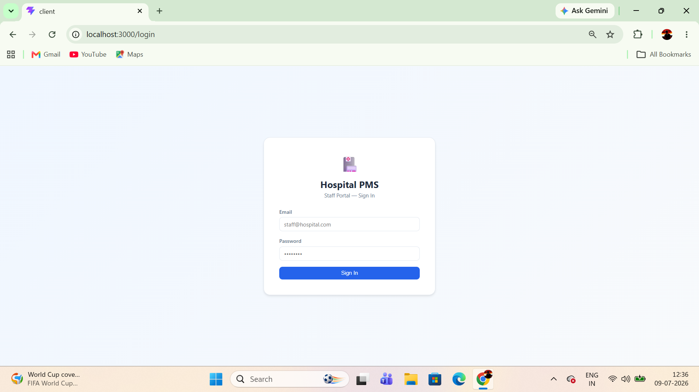
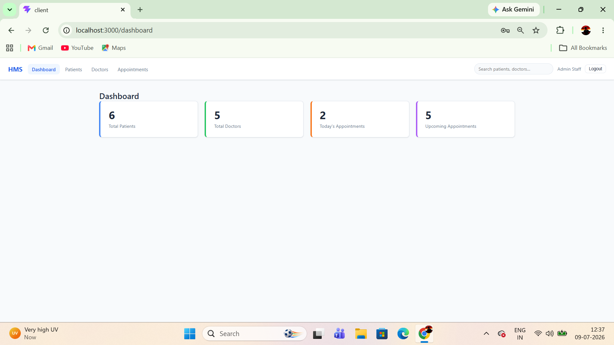
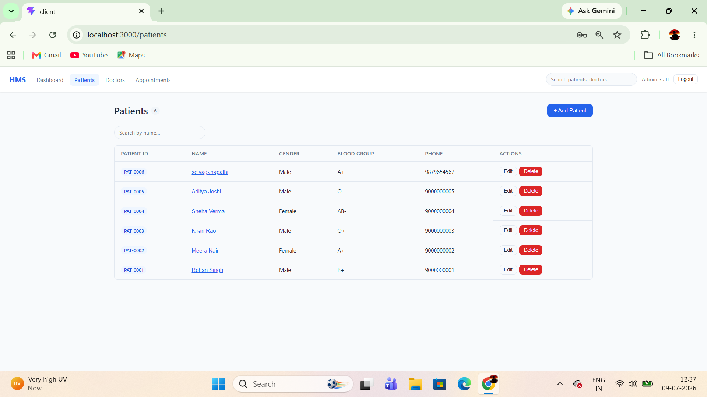
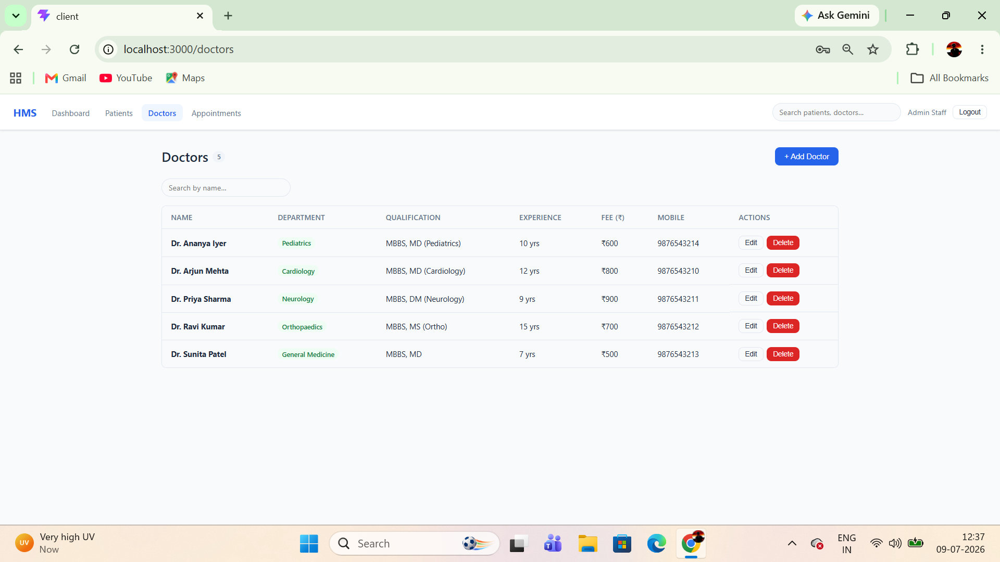
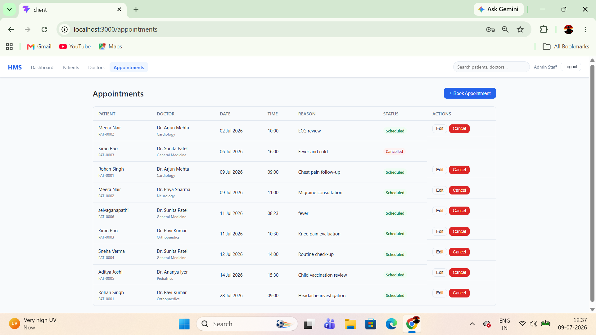

# Hospital Patient Management System

A staff-facing web app for managing hospital patients, doctors, and appointments. No patient or doctor portal — this is purely for internal hospital staff.

## Live Demo

| | URL |
|---|---|
| **App** | https://hms-pms.vercel.app |
| **API** | https://hospital-pms-api-production.up.railway.app |

**Default login credentials**

| Name | Email | Password |
|---|---|---|
| Admin Staff | admin@hospital.com | admin123 |
| Reception Desk | reception@hospital.com | reception123 |

## Screenshots

### Login


### Dashboard


### Patients


### Doctors


### Appointments


## Tech Stack

| Layer | Technology | Hosted on |
|---|---|---|
| Frontend | React 19 (Vite), React Router v7 | Vercel |
| Backend | Node.js, Express 4 | Railway |
| Database | MongoDB (Mongoose) | Railway |
| Auth | JWT (jsonwebtoken), bcryptjs | — |
| HTTP client | Axios | — |

## Folder Structure

```
hospital-pms/
├── client/                  # React frontend (Vite)
│   └── src/
│       ├── context/         # AuthContext (login state, token storage)
│       ├── services/        # Axios instance with JWT interceptors
│       ├── components/      # Navbar, Layout, Modal, Pagination, GlobalSearch, ProtectedRoute
│       └── pages/           # Login, Dashboard, Patients, Doctors, Appointments, PatientProfile
├── server/                  # Express backend
│   ├── config/              # MongoDB connection
│   ├── models/              # User, Patient, Doctor, Appointment
│   ├── middleware/          # JWT auth guard, centralized error handler
│   ├── routes/              # Route definitions
│   ├── controllers/         # Request handlers
│   ├── seed.js              # Sample data (see below)
│   └── index.js             # Server entry point
└── postman/                 # Postman collection (all endpoints)
```

## API Reference

| Method | Endpoint | Auth | Description |
|---|---|---|---|
| POST | `/api/auth/login` | No | Staff login |
| GET | `/api/dashboard` | Yes | Summary counts |
| GET | `/api/patients` | Yes | List patients (search, pagination) |
| GET | `/api/patients/:id` | Yes | Single patient |
| GET | `/api/patients/:id/appointments` | Yes | Patient profile + appointment history |
| POST | `/api/patients` | Yes | Add patient |
| PUT | `/api/patients/:id` | Yes | Update patient |
| DELETE | `/api/patients/:id` | Yes | Delete patient |
| GET | `/api/doctors` | Yes | List doctors (search) |
| GET | `/api/doctors/:id` | Yes | Single doctor |
| POST | `/api/doctors` | Yes | Add doctor |
| PUT | `/api/doctors/:id` | Yes | Update doctor |
| DELETE | `/api/doctors/:id` | Yes | Delete doctor |
| GET | `/api/appointments` | Yes | List all appointments |
| POST | `/api/appointments` | Yes | Book appointment (validates date, double-booking) |
| PUT | `/api/appointments/:id` | Yes | Update appointment |
| DELETE | `/api/appointments/:id` | Yes | Cancel appointment |
| GET | `/api/search?q=...` | Yes | Global search across patients + doctors |

## Installation

### Prerequisites

- Node.js 18+
- MongoDB running locally (or a MongoDB Atlas URI)

### 1. Clone the repo

```bash
git clone https://github.com/Selvaganapathi-P/hospital-pms.git
cd hospital-pms
```

### 2. Backend setup

```bash
cd server
npm install
cp .env.example .env
```

Edit `server/.env`:

```
PORT=5001
MONGODB_URI=mongodb://localhost:27017/hospital-pms
JWT_SECRET=change_this_to_something_long_and_random
JWT_EXPIRES_IN=7d
```

> If port 5001 is already in use on your machine, change `PORT` here and update the `proxy.target` in `client/vite.config.js` to match.

### 3. Frontend setup

```bash
cd ../client
npm install
```

The Vite dev server proxies `/api` requests to `localhost:5001`, so no extra config needed for local dev.

### 4. Seed the database

Make sure MongoDB is running and `.env` is configured, then stop the backend if it's running and execute:

```bash
cd server
npm run seed
```

This is the MongoDB equivalent of a SQL dump — it wipes existing data and inserts a fresh set of users, patients, doctors, and appointments so you can explore the app immediately.

### 5. Run the app

Open two separate terminals:

```bash
# Terminal 1 — backend
cd server
npm run dev

# Terminal 2 — frontend
cd client
npm run dev
```

Frontend runs at **http://localhost:3000**, backend at **http://localhost:5001**.

## Deployment

The app is deployed across two platforms with auto-deploy on every push to `master`.

| Service | Platform | URL |
|---|---|---|
| Frontend | Vercel | https://hms-pms.vercel.app |
| Backend API | Railway | https://hospital-pms-api-production.up.railway.app |
| MongoDB | Railway (internal) | Private — only accessible by the backend |

### Environment variables

**Backend (Railway)**

| Variable | Description |
|---|---|
| `MONGODB_URI` | MongoDB internal connection string |
| `JWT_SECRET` | Secret key for signing JWT tokens |
| `JWT_EXPIRES_IN` | Token expiry (default `7d`) |
| `CLIENT_URL` | Comma-separated list of allowed frontend origins |
| `NODE_ENV` | `production` |

**Frontend (Vercel)**

| Variable | Description |
|---|---|
| `VITE_API_URL` | Full URL of the backend API (e.g. `https://.../api`) |

### Seed the live database

To populate the Railway MongoDB with sample data, run locally using the Railway public MongoDB URL:

```bash
MONGODB_URI="mongodb://<user>:<pass>@<host>:<port>/hospital-pms?authSource=admin" node server/seed.js
```

## Postman

Import `postman/Hospital_PMS.postman_collection.json` into Postman. Run the **Login** request first — it auto-saves the token to a collection variable that all other requests use. The collection is pre-configured to hit `http://localhost:5001`.
